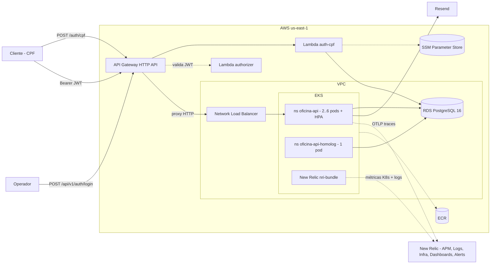
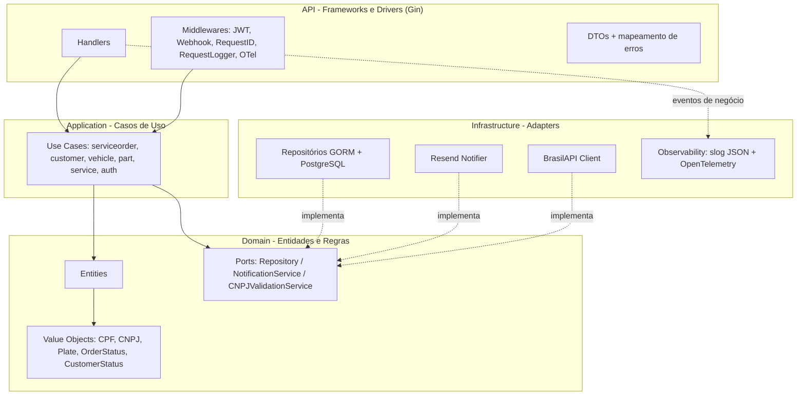
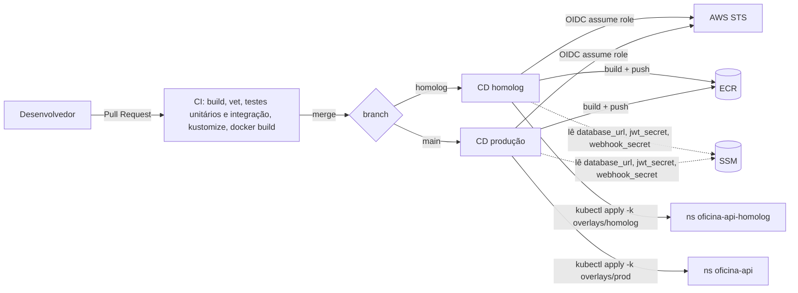

# Tech Challenge — Oficina Mecânica API

[](https://github.com/gaabriel165/oficina-api/actions/workflows/ci.yml)
[](https://github.com/gaabriel165/oficina-api/actions/workflows/cd.yml)

Back-end do **Sistema Integrado de Atendimento e Execução de Serviços** de uma oficina mecânica, desenvolvido para o Tech Challenge da pós-graduação em Arquitetura de Software (FIAP SOAT).

- **Fase 1** — MVP com gestão de ordens de serviço, clientes, veículos, peças e serviços, aplicando DDD, JWT e testes.
- **Fase 2** — Clean Architecture, containerização, Kubernetes (EKS), Terraform e CI/CD.
- **Fase 3** — operação corporativa: **API Gateway** como porta única, **autenticação de clientes por CPF via Lambda**, quatro repositórios com **CI/CD e deploy automático** (homologação e produção), **observabilidade com New Relic** (traces, logs JSON correlacionados, dashboards e alertas) e **documentação arquitetural** completa (componentes, sequências, RFCs, ADRs, ER).

## Os quatro repositórios

| Repositório | Responsabilidade | Entrega |
|---|---|---|
| **[oficina-api](https://github.com/gaabriel165/oficina-api)** (este) | Aplicação principal em Go, Clean Architecture | Imagem no ECR e deploy no EKS via kustomize — branch `homolog` → namespace `oficina-api-homolog`, `main` → `oficina-api` |
| [oficina-infra-k8s](https://github.com/gaabriel165/oficina-infra-k8s) | Infraestrutura Kubernetes (Terraform) | VPC, EKS 1.34, ECR, OIDC + roles do GitHub Actions, segredos no SSM, metrics-server e New Relic via Helm |
| [oficina-infra-db](https://github.com/gaabriel165/oficina-infra-db) | Banco gerenciado (Terraform) | RDS PostgreSQL 16 privado, security groups, `DATABASE_URL` no SSM |
| [oficina-lambda-auth](https://github.com/gaabriel165/oficina-lambda-auth) | Function serverless + API Gateway (Go + Terraform) | Lambda `auth-cpf` (valida CPF, consulta cliente, emite JWT), Lambda `authorizer`, API Gateway HTTP API |

Ordem de provisionamento: `oficina-infra-k8s` → `oficina-infra-db` → `oficina-api` (CD) → `oficina-lambda-auth`. Destruição na ordem inversa.

## Links

- **Documentação de arquitetura (Fase 3):** [`docs/architecture/`](./docs/architecture/README.md) — [componentes](./docs/architecture/components.md) · [sequência: autenticação](./docs/architecture/sequence-authentication.md) · [sequência: ordem de serviço](./docs/architecture/sequence-service-order.md) · [banco de dados e ER](./docs/architecture/database.md) · [RFCs](./docs/architecture/rfc/) · [ADRs](./docs/architecture/adr/)
- **Swagger (com o ambiente no ar):** `https://<api-id>.execute-api.us-east-1.amazonaws.com/swagger/index.html` (via API Gateway) ou `http://<nlb-host>/swagger/index.html`
- **Collection das APIs (Insomnia):** [`insomnia-collection.json`](./insomnia-collection.json)
- **Documentação DDD (Event Storming, Fase 1):** [miro.com/app/board/uXjVHZWTzN0=/](https://miro.com/app/board/uXjVHZWTzN0=/)
- **Vídeo Fase 2:** https://youtu.be/KcicodFkWag · **Vídeo Fase 3:** https://youtu.be/UpkiPBkgyVE

> O ambiente AWS é **provisionado sob demanda** (custo por hora) e destruído após cada sessão de testes. Os links de deploy podem estar fora do ar no momento da avaliação; o vídeo demonstra o pipeline e o ambiente em execução.

---

## Arquitetura

### 1. Visão de nuvem (Fase 3)



Detalhes e o diagrama completo (com GitHub Actions, CloudWatch, S3 state) em [`docs/architecture/components.md`](./docs/architecture/components.md).

### 2. Componentes da aplicação (Clean Architecture)

As dependências apontam sempre **para dentro**: a API depende dos casos de uso, que dependem do domínio. A infraestrutura implementa as **portas** (interfaces) definidas no domínio — nada do domínio conhece framework, banco, HTTP ou telemetria.



| Camada | Pasta | Responsabilidade | Depende de |
|---|---|---|---|
| **Domain** | `internal/domain` | Entidades, value objects, regras de negócio e **portas** | nada externo |
| **Application** | `internal/application` | Casos de uso (um por operação); orquestra o domínio | apenas do domínio |
| **Infrastructure** | `internal/infrastructure` | Adapters: GORM/PostgreSQL, Resend, BrasilAPI, observabilidade | implementa portas do domínio |
| **API** | `internal/api` | Handlers Gin, middlewares, DTOs, mapeamento de erros | dos casos de uso |

### 3. Fluxo de deploy (CI/CD)



A branch `main` é **protegida**: sem commits diretos, merge apenas por Pull Request com o CI verde.

---

## Autenticação

Dois emissores produzem o **mesmo JWT HS256**, assinado com o segredo único guardado no SSM (`/oficina-api/jwt_secret`):

| Quem | Como | Onde |
|---|---|---|
| Operador da oficina | `POST /api/v1/auth/login` com e-mail e senha (bcrypt) | Esta API |
| Cliente | `POST /auth/cpf` com o CPF — a Lambda valida o CPF, confirma que o cliente existe e está **ativo** e devolve o token | [oficina-lambda-auth](https://github.com/gaabriel165/oficina-lambda-auth) via API Gateway |

As rotas sob `/api/v1/*` são protegidas em **duas camadas**: o **Lambda authorizer** do API Gateway rejeita tokens inválidos na borda (401) e o middleware `Auth` da aplicação valida de novo (defesa em profundidade). Rotas públicas: `/health`, `/ready`, `/swagger/*`, `POST /api/v1/auth/login|register`, `GET /api/v1/service-orders/{id}/status` e o webhook `POST /api/v1/service-orders/{id}/budget-approval` (protegido por `X-Webhook-Secret`).

O token carrega a claim `role`, e a aplicação autoriza por papel:

| Papel | Emissor | Pode |
|---|---|---|
| `operator` | `POST /api/v1/auth/login` | Todas as rotas |
| `customer` | `POST /auth/cpf` (Lambda) | Listar e consultar **apenas as próprias** ordens de serviço, aprovar ou recusar **o próprio** orçamento. Qualquer outra rota responde **403** |

Clientes podem ser desativados com `PATCH /api/v1/customers/{id}/status` (`{"status":"inactive"}`); a Lambda passa a responder **403** para o CPF. Detalhes em [RFC-003](./docs/architecture/rfc/RFC-003-estrategia-de-autenticacao.md) e [ADR-003](./docs/architecture/adr/ADR-003-jwt-hs256-segredo-compartilhado.md).

## Observabilidade (New Relic)

| Requisito | Implementação |
|---|---|
| Latência das APIs | Spans HTTP (`otelgin`) e de banco (plugin GORM) exportados via **OTLP** para o New Relic; campo `latency_ms` em cada log `http.request` |
| CPU e memória do Kubernetes | `nri-bundle` (infra agent + kube-state-metrics) instalado pelo CD do `oficina-infra-k8s` |
| Healthchecks e uptime | `/health` (processo) e `/ready` (ping no banco) usados pelas probes; monitor Synthetics no `/health` via API Gateway |
| Alertas de falha no processamento de OS | Evento `service_order.failed` → condição NRQL `count(*) > 0` em 5 min → e-mail |
| Logs estruturados com correlação | `log/slog` em JSON com `request_id` (header `X-Request-ID`, gerado quando ausente), `trace_id` e `span_id` do OpenTelemetry em toda linha; Fluent Bit envia o stdout dos pods |

Eventos de negócio (campo `event`) que alimentam os dashboards:

| Evento | Quando | Campos relevantes |
|---|---|---|
| `service_order.created` | OS aberta | `order_id`, `customer_id`, `services`, `parts` |
| `service_order.status_changed` | Qualquer transição | `from_status`, `to_status`, `duration_minutes` (tempo no status anterior), `total_amount` |
| `service_order.failed` | Erro em rota de OS | `action`, `order_id`, `error` |
| `integration.error` | Falha no Resend ou na BrasilAPI | `integration`, `operation`, `error` |
| `http.request` | Toda requisição | `method`, `route`, `status`, `latency_ms` |

Dashboards expostos: **volume diário de OS**, **tempo médio por status** (diagnóstico, execução, finalização), **erros e falhas nas integrações**, latência p50/p95 e CPU/memória por pod. NRQL de referência em [`sequence-service-order.md`](./docs/architecture/sequence-service-order.md) e [RFC-004](./docs/architecture/rfc/RFC-004-ferramenta-de-observabilidade.md).

---

## Stack

| Categoria | Tecnologias |
|---|---|
| **Aplicação** | Go 1.25, Gin, GORM, golang-migrate, golang-jwt |
| **Observabilidade** | `log/slog` (JSON), OpenTelemetry (`otelgin`, plugin GORM, exportador OTLP/HTTP), New Relic |
| **Banco** | PostgreSQL 16 (local via Docker, produção via RDS) |
| **E-mail** | Resend (adapter atrás da porta `NotificationService`) |
| **Testes** | Testify, Mockery, testcontainers-go |
| **Container** | Docker (multi-stage, binário estático, non-root) |
| **Orquestração** | Kubernetes (AWS EKS) + kustomize (base + overlays) + HPA |
| **Borda** | AWS API Gateway HTTP API + Lambda authorizer |
| **IaC / CI/CD** | Terraform (repos de infra) · GitHub Actions com OIDC |

### Por que PostgreSQL?

Modelo relacional com integridade referencial, transações (aprovação de orçamento + débito de estoque atômicos), tipos `UUID`/`NUMERIC`/`TIMESTAMP`, migrations maduras no ecossistema Go e RDS gerenciado. Justificativa formal, diagrama ER e os ajustes da Fase 3 (status do cliente, índices, normalização) em [`docs/architecture/database.md`](./docs/architecture/database.md).

---

## Conceitos de Domínio

| Entidade | Descrição |
|---|---|
| **User** | Operador do sistema — autenticado via e-mail/senha, recebe JWT |
| **Customer** | Proprietário do veículo — identificado por CPF ou CNPJ; possui **status** `active`/`inactive` |
| **Vehicle** | Pertence a um Customer — placa (formato antigo ou Mercosul) |
| **Service** | Mão de obra oferecida (ex: Troca de Óleo) |
| **Part** | Peça física com controle de estoque |
| **ServiceOrder** | Agregado principal — controla o ciclo de vida do reparo e registra a última transição de status |

```
received → in_diagnosis → waiting_approval → in_execution → finished → delivered
                                          ↘ cancelled (orçamento rejeitado)
```

Cada transição dispara uma **notificação por e-mail** ao cliente (best-effort) e um evento `service_order.status_changed` nos logs.

---

## Como Executar

### A) Local (docker-compose)

```bash
cp .env.example .env      # ajuste as variáveis
docker compose up --build
```

- API: `http://localhost:8080` · Swagger: `http://localhost:8080/swagger/index.html`
- Sobe a aplicação + PostgreSQL; migrations e seed rodam automaticamente no startup.
- Usuário seed: `admin@oficina.com` / `admin123`. Cliente seed com CPF `98765432100`.
- Para enviar traces localmente, preencha `OTEL_EXPORTER_OTLP_ENDPOINT` e `OTEL_EXPORTER_OTLP_HEADERS` (`api-key=<license>`).

### B) Infraestrutura

Provisionada pelos repositórios dedicados (Terraform): [oficina-infra-k8s](https://github.com/gaabriel165/oficina-infra-k8s) (rede, EKS, ECR, OIDC, SSM) e [oficina-infra-db](https://github.com/gaabriel165/oficina-infra-db) (RDS). O API Gateway e as Lambdas ficam em [oficina-lambda-auth](https://github.com/gaabriel165/oficina-lambda-auth).

### C) Deploy em Kubernetes

O **CD faz isso automaticamente**: push em `homolog` → namespace `oficina-api-homolog`; merge em `main` → namespace `oficina-api`. O pipeline builda a imagem, publica no ECR, lê `database_url`, `jwt_secret` e `webhook_secret` do SSM, cria o Secret e aplica o overlay.

Manualmente:

```bash
aws eks update-kubeconfig --name oficina-api-eks --region us-east-1

kubectl create namespace oficina-api
kubectl create secret generic oficina-api-secrets -n oficina-api \
  --from-literal=DATABASE_URL="$(aws ssm get-parameter --name /oficina-api/database_url --with-decryption --query Parameter.Value --output text)" \
  --from-literal=JWT_SECRET="$(aws ssm get-parameter --name /oficina-api/jwt_secret --with-decryption --query Parameter.Value --output text)" \
  --from-literal=WEBHOOK_SECRET="$(aws ssm get-parameter --name /oficina-api/webhook_secret --with-decryption --query Parameter.Value --output text)" \
  --from-literal=RESEND_API_KEY="re_..." \
  --from-literal=OTEL_EXPORTER_OTLP_HEADERS="api-key=<new-relic-license>"

(cd k8s/base && kustomize edit set image oficina-api=<ecr-url>:<tag>)
kubectl apply -k k8s/overlays/prod
kubectl get svc oficina-api -n oficina-api      # host do NLB
```

### D) Autenticar por CPF e consumir a API protegida (via API Gateway)

```bash
GW=https://<api-id>.execute-api.us-east-1.amazonaws.com

TOKEN=$(curl -s -X POST "$GW/auth/cpf" -H 'Content-Type: application/json' \
  -d '{"cpf":"98765432100"}' | jq -r .token)

curl -s "$GW/api/v1/service-orders" -H "Authorization: Bearer $TOKEN"
```

---

## Variáveis de Ambiente

| Variável | Descrição |
|---|---|
| `SERVER_PORT` | Porta HTTP (padrão `8080`) |
| `APP_ENV` | Ambiente (`local`, `homolog`, `production`) — vai para os logs e traces |
| `DATABASE_URL` | String de conexão do PostgreSQL |
| `JWT_SECRET` | Chave HS256 compartilhada com a Lambda de autenticação |
| `WEBHOOK_SECRET` | Segredo do webhook de aprovação de orçamento |
| `RESEND_API_KEY` / `EMAIL_FROM` | Envio de e-mails |
| `OTEL_SERVICE_NAME` | Nome do serviço na telemetria (padrão `oficina-api`) |
| `OTEL_EXPORTER_OTLP_ENDPOINT` | Endpoint OTLP/HTTP (New Relic: `https://otlp.nr-data.net:4318`); vazio desliga o tracing |
| `OTEL_EXPORTER_OTLP_HEADERS` | Cabeçalhos do exportador (`api-key=<license>`) |

---

## Endpoints da API

> Base URL: `https://<api-id>.execute-api.us-east-1.amazonaws.com/api/v1` (gateway) ou `http://<host>:8080/api/v1`

### Público
| Método | Caminho | Descrição |
|---|---|---|
| POST | `/auth/cpf` | **(API Gateway → Lambda)** Autenticar cliente por CPF e receber JWT |
| POST | `/api/v1/auth/register` | Criar usuário operador |
| POST | `/api/v1/auth/login` | Autenticar operador e receber JWT |
| GET | `/api/v1/service-orders/{id}/status` | Consulta de status pelo cliente |
| GET | `/health` · `/ready` | Liveness · readiness (ping no banco) |

### Ordens de Serviço (JWT)
| Método | Caminho | Descrição |
|---|---|---|
| POST | `/api/v1/service-orders` | Abrir OS (cliente, veículo, serviços e peças na mesma chamada) |
| GET | `/api/v1/service-orders` | Listar OS ativas ordenadas por urgência (cliente vê só as suas) |
| GET | `/api/v1/service-orders/{id}` | Detalhar OS (cliente só a própria) |
| GET | `/api/v1/service-orders/metrics` | Tempo médio de execução por serviço |
| POST | `/api/v1/service-orders/{id}/budget-approval` | **Webhook** de aprovação/recusa externa (`X-Webhook-Secret`) |
| PATCH | `.../approve-budget` · `/reject-budget` | Decisão do orçamento (operador ou o próprio cliente) |
| PATCH | `.../start-diagnosis` · `/send-budget` · `/finish-execution` · `/deliver` | Transições operacionais (só operador) |
| POST | `/api/v1/service-orders/{id}/services` · `/parts` | Adicionar serviço / peça |

### Roteamento no API Gateway
| Rota | Autenticação na borda | Destino |
|---|---|---|
| `POST /auth/cpf` | nenhuma | Lambda `auth-cpf` |
| `GET /health`, `GET /swagger/{proxy+}` | nenhuma | EKS (proxy HTTP) |
| `POST /api/v1/auth/login`, `POST /api/v1/auth/register` | nenhuma | EKS |
| `GET /api/v1/service-orders/{id}/status` | nenhuma | EKS |
| `POST /api/v1/service-orders/{id}/budget-approval` | `X-Webhook-Secret` (na aplicação) | EKS |
| `ANY /api/v1/{proxy+}` | Lambda authorizer (JWT HS256) | EKS |

### CRUDs administrativos (JWT de operador)
`/api/v1/customers` (+ `PATCH /{id}/status`), `/api/v1/vehicles`, `/api/v1/parts` (+ `PATCH /{id}/stock`), `/api/v1/services` — todos com `GET` (lista), `POST`, `GET/{id}`, `PUT/{id}`, `DELETE/{id}`.

---

## Estrutura de pastas

```
cmd/api/                  → entrypoint (logger, tracing, migrations, graceful shutdown)
configs/                  → carregamento de variáveis de ambiente
internal/
  domain/                 → entities, value objects, ports, erros de domínio
  application/usecase/    → casos de uso (um por operação) + mocks
  infrastructure/         → GORM (PostgreSQL), Resend, BrasilAPI, observability (slog + OTel)
  api/                    → handlers, middlewares, DTOs, mapeamento de erros, server.go
migrations/               → migrations SQL versionadas (golang-migrate)
docs/architecture/        → documentação arquitetural da Fase 3 (Mermaid, RFCs, ADRs)
docs/                     → Swagger gerado
k8s/base + k8s/overlays/  → manifestos Kubernetes (kustomize): prod e homolog
load/                     → script k6 para demonstrar o HPA
.github/workflows/        → CI (PR) e CD (homolog / main)
```

## Testes

```bash
# unitários (domínio + casos de uso + api + observabilidade)
go test ./internal/domain/... ./internal/application/... ./internal/api/... ./internal/infrastructure/observability/...

# integração (sobe PostgreSQL via testcontainers — requer Docker)
go test ./internal/integration/... -timeout 300s

# cobertura
go test ./internal/... -coverprofile=coverage.out && go tool cover -func=coverage.out
```

## CI/CD

- **`ci.yml`** — em todo Pull Request: `build`, `vet`, testes unitários e de integração, validação dos overlays kustomize e build da imagem Docker.
- **`cd.yml`** — push em `homolog` ou `main`: autentica na AWS via **OIDC**, builda e publica a imagem no **ECR**, lê os segredos do **SSM** e faz o deploy no namespace do ambiente com `kubectl apply -k`.

Configuração no GitHub (Settings → Secrets and variables → Actions):
- **Variables:** `AWS_REGION`, `EKS_CLUSTER_NAME`, `ECR_REPOSITORY_URL`
- **Secrets:** `AWS_ROLE_ARN` (role `oficina-api-app-github-actions`), `RESEND_API_KEY`, `NEW_RELIC_LICENSE_KEY`
