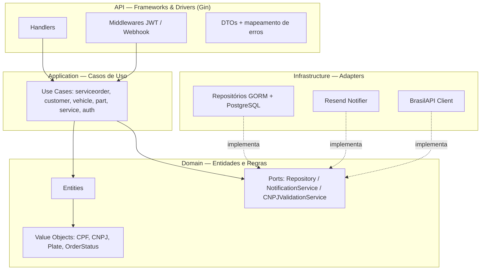
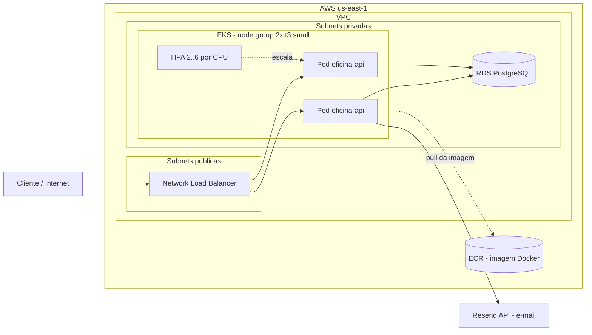
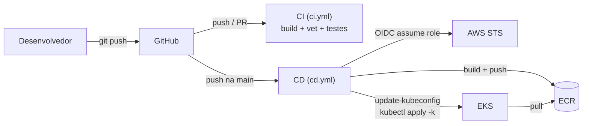

# Tech Challenge — Oficina Mecânica API

[](https://github.com/gaabriel165/oficina-api/actions/workflows/ci.yml)

Back-end do **Sistema Integrado de Atendimento e Execução de Serviços** de uma oficina mecânica, desenvolvido para o Tech Challenge da pós-graduação em Arquitetura de Software (FIAP SOAT).

- **Fase 1** — MVP com gestão de ordens de serviço, clientes, veículos, peças e serviços, aplicando DDD, JWT e testes.
- **Fase 2** — evolução para **qualidade, resiliência e escalabilidade**: refatoração em Clean Architecture, containerização, orquestração em Kubernetes (EKS), infraestrutura como código (Terraform) e pipeline de CI/CD.

## Objetivos da Fase 2

- **Clean Architecture / Hexagonal** — separação estrita de camadas e inversão de dependências.
- **Novas APIs** — abertura de OS em chamada única, consulta de status, listagem priorizada, webhook de aprovação de orçamento e notificação de status por e-mail.
- **Escalabilidade** — Horizontal Pod Autoscaler escalando por CPU sob carga.
- **Automação** — provisionamento (Terraform) e deploy (CI/CD) reproduzíveis.

## Links

- **Collection das APIs (Insomnia):** [`insomnia-collection.json`](./insomnia-collection.json)
- **Swagger (com a aplicação no ar):** `http://<load-balancer-host>/swagger/index.html`
- **Documentação DDD (Event Storming):** [miro.com/app/board/uXjVHZWTzN0=/](https://miro.com/app/board/uXjVHZWTzN0=/)
- **Vídeo demonstrativo:** https://youtu.be/KcicodFkWag

---

## Arquitetura

### 1. Componentes da aplicação (Clean Architecture)

As dependências apontam sempre **para dentro**: a API depende dos casos de uso, que dependem do domínio. A infraestrutura implementa as **portas** (interfaces) definidas no domínio — nada do domínio conhece framework, banco ou HTTP.



### 2. Infraestrutura provisionada (AWS)



### 3. Fluxo de deploy (CI/CD)



---

## Clean Architecture — a regra de dependência

| Camada | Pasta | Responsabilidade | Depende de |
|---|---|---|---|
| **Domain** | `internal/domain` | Entidades, value objects, regras de negócio e **portas** (interfaces) | nada externo |
| **Application** | `internal/application` | Casos de uso (um por operação); orquestra o domínio | apenas do domínio |
| **Infrastructure** | `internal/infrastructure` | Adapters: GORM/PostgreSQL, Resend, BrasilAPI | implementa portas do domínio |
| **API** | `internal/api` | Handlers Gin, middlewares, DTOs, mapeamento de erros | dos casos de uso |

Princípios aplicados:
- **Inversão de dependência** — casos de uso dependem de interfaces (`ServiceOrderRepository`, `NotificationService`), não de implementações. Trocar PostgreSQL, o provedor de e-mail ou o webhook não toca o domínio nem os casos de uso.
- **Domínio sem frameworks** — nenhum import de Gin, GORM, JWT ou HTTP no pacote `domain`.
- **Composition root único** — a montagem concreta (repos, adapters, use cases) acontece só no `internal/api/server.go`.
- **Entidades ricas** — invariantes e transições de estado da OS vivem na entidade, não em serviços anêmicos.

### Estrutura de pastas

```
cmd/api/                  → entrypoint
configs/                  → carregamento de variáveis de ambiente
internal/
  domain/                 → entities, value objects, ports (interfaces), erros de domínio
  application/usecase/     → casos de uso (um por operação) + mocks
  infrastructure/          → GORM (PostgreSQL), Resend (e-mail), BrasilAPI, migrations
  api/                     → handlers, middlewares, DTOs, mapeamento de erros, server.go
migrations/               → migrations SQL versionadas (golang-migrate)
docs/                     → Swagger gerado
k8s/                      → manifestos Kubernetes (kustomize)
infra/                    → Terraform (VPC, EKS, RDS, ECR, OIDC)
.github/workflows/         → pipelines de CI e CD
```

---

## Stack

| Categoria | Tecnologias |
|---|---|
| **Aplicação** | Go 1.25, Gin, GORM, golang-migrate, golang-jwt |
| **Banco** | PostgreSQL 16 (local via Docker, produção via RDS) |
| **E-mail** | Resend (adapter atrás de porta `NotificationService`) |
| **Testes** | Testify, Mockery, testcontainers-go |
| **Container** | Docker (multi-stage, imagem estática non-root) |
| **Orquestração** | Kubernetes (AWS EKS) + kustomize + HPA |
| **IaC** | Terraform (VPC, EKS, RDS, ECR, IAM/OIDC) |
| **CI/CD** | GitHub Actions (OIDC, sem chave estática) |

### Por que PostgreSQL?

- **Modelo relacional** adequado às entidades e à consistência transacional (aprovação de orçamento + débito de estoque atômicos).
- **Integridade referencial** via chaves estrangeiras.
- **Tipos avançados**: `UUID`, `TIMESTAMPTZ`, `NUMERIC` para valores monetários.
- **Migrations versionadas** maduras no ecossistema Go (`golang-migrate`).
- **RDS gerenciado** em produção: backups, criptografia e escalabilidade sem gestão manual.

---

## Conceitos de Domínio

| Entidade | Descrição |
|---|---|
| **User** | Operador do sistema — autenticado via e-mail/senha, recebe JWT |
| **Customer** | Proprietário do veículo — identificado por CPF ou CNPJ |
| **Vehicle** | Pertence a um Customer — placa (formato antigo ou Mercosul) |
| **Service** | Mão de obra oferecida (ex: Troca de Óleo) |
| **Part** | Peça física com controle de estoque |
| **ServiceOrder** | Agregado principal — controla o ciclo de vida do reparo |

### Fluxo de status da Ordem de Serviço

```
received → in_diagnosis → waiting_approval → in_execution → finished → delivered
                                          ↘ cancelled (orçamento rejeitado)
```

Cada transição dispara uma **notificação por e-mail** ao cliente (best-effort — falha de e-mail não interrompe a operação).

---

## Como Executar

### A) Local (docker-compose)

```bash
cp .env.example .env      # ajuste as variáveis
docker-compose up --build
```

- API: `http://localhost:8080` · Swagger: `http://localhost:8080/swagger/index.html`
- Sobe a aplicação + PostgreSQL; migrations e seed rodam automaticamente no startup.

### B) Provisionar a infraestrutura (Terraform)

Pré-requisitos: conta AWS, AWS CLI configurado, Terraform.

```bash
cd infra
terraform init
terraform plan            # revisa o que será criado
terraform apply           # provisiona VPC, EKS, RDS, ECR, OIDC (~20 min)

# conectar kubectl ao cluster:
aws eks update-kubeconfig --name oficina-api-eks --region us-east-1
```

Recursos criados: VPC (subnets públicas/privadas + NAT), cluster **EKS**, **RDS PostgreSQL** privado, repositório **ECR** e o **role OIDC** para o GitHub Actions. Saídas úteis: `terraform output`. Para remover tudo: `terraform destroy`.

### C) Deploy em Kubernetes

O **CD faz isso automaticamente** no push para `main`. Manualmente:

```bash
# 1. metrics-server (pré-requisito do HPA)
kubectl apply -f https://github.com/kubernetes-sigs/metrics-server/releases/latest/download/components.yaml

# 2. Secret da aplicação (a partir dos outputs do Terraform + suas chaves)
kubectl create namespace oficina-api
kubectl create secret generic oficina-api-secrets -n oficina-api \
  --from-literal=DATABASE_URL="$(terraform -chdir=infra output -raw database_url)" \
  --from-literal=JWT_SECRET="..." \
  --from-literal=WEBHOOK_SECRET="..." \
  --from-literal=RESEND_API_KEY="re_..."

# 3. apontar a imagem do ECR e aplicar
cd k8s
kustomize edit set image oficina-api=$(terraform -chdir=../infra output -raw ecr_repository_url):latest
kubectl apply -k .

# 4. URL pública
kubectl get service oficina-api -n oficina-api
```

---

## Variáveis de Ambiente

| Variável | Descrição |
|---|---|
| `SERVER_PORT` | Porta HTTP (padrão `8080`) |
| `DATABASE_URL` | String de conexão do PostgreSQL |
| `JWT_SECRET` | Chave de assinatura do JWT |
| `WEBHOOK_SECRET` | Segredo do webhook de aprovação de orçamento |
| `RESEND_API_KEY` | Chave da API do Resend (e-mail) |
| `EMAIL_FROM` | Remetente dos e-mails (ex.: `onboarding@resend.dev`) |

---

## Endpoints da API

> Base URL: `http://<host>:8080/api/v1`

### Autenticação (público)
| Método | Caminho | Descrição |
|---|---|---|
| POST | `/api/v1/auth/register` | Criar usuário |
| POST | `/api/v1/auth/login` | Autenticar e receber JWT |

### Ordens de Serviço
| Método | Caminho | Auth | Descrição |
|---|---|---|---|
| POST | `/api/v1/service-orders` | JWT | Abrir OS (aceita cliente, veículo, **serviços e peças** na mesma chamada) |
| GET | `/api/v1/service-orders` | JWT | Listar OS **ativas**, ordenadas por urgência (mais antigas primeiro); exclui finalizadas/entregues |
| GET | `/api/v1/service-orders/{id}` | JWT | Detalhar OS |
| GET | `/api/v1/service-orders/{id}/status` | **Público** | Consulta de status pelo cliente |
| GET | `/api/v1/service-orders/metrics` | JWT | Tempo médio de execução por serviço |
| POST | `/api/v1/service-orders/{id}/budget-approval` | **Webhook** | Aprovação/recusa externa (`X-Webhook-Secret`) |
| PATCH | `/api/v1/service-orders/{id}/start-diagnosis` | JWT | Iniciar diagnóstico |
| POST | `/api/v1/service-orders/{id}/services` · `/parts` | JWT | Adicionar serviço / peça |
| PATCH | `.../send-budget` · `/approve-budget` · `/reject-budget` · `/finish-execution` · `/deliver` | JWT | Transições de status |

### CRUDs administrativos (JWT)
`/api/v1/customers`, `/api/v1/vehicles`, `/api/v1/parts` (+ `PATCH /{id}/stock`), `/api/v1/services` — todos com `GET` (lista), `POST`, `GET/{id}`, `PUT/{id}`, `DELETE/{id}`.

---

## Testes

```bash
# unitários (domínio + casos de uso + api)
go test ./internal/domain/... ./internal/application/... ./internal/api/...

# integração (sobe PostgreSQL via testcontainers — requer Docker)
go test ./internal/integration/... -timeout 300s

# cobertura
go test ./internal/... -coverprofile=coverage.out && go tool cover -func=coverage.out
```

Cobertura atual: **~88%** (acima do mínimo de 80% exigido).

## CI/CD

- **`ci.yml`** — em todo push/PR: `build`, `vet` e testes (unitários + integração). Não toca a AWS.
- **`cd.yml`** — no push para `main`: autentica na AWS via **OIDC**, builda e publica a imagem no **ECR**, e faz o deploy no **EKS** (`kubectl apply -k`), incluindo metrics-server e o Secret da aplicação.

Configuração no GitHub (Settings → Secrets and variables → Actions):
- **Variables:** `AWS_REGION`, `EKS_CLUSTER_NAME`, `ECR_REPOSITORY_URL`
- **Secrets:** `AWS_ROLE_ARN`, `DATABASE_URL`, `JWT_SECRET`, `WEBHOOK_SECRET`, `RESEND_API_KEY`
