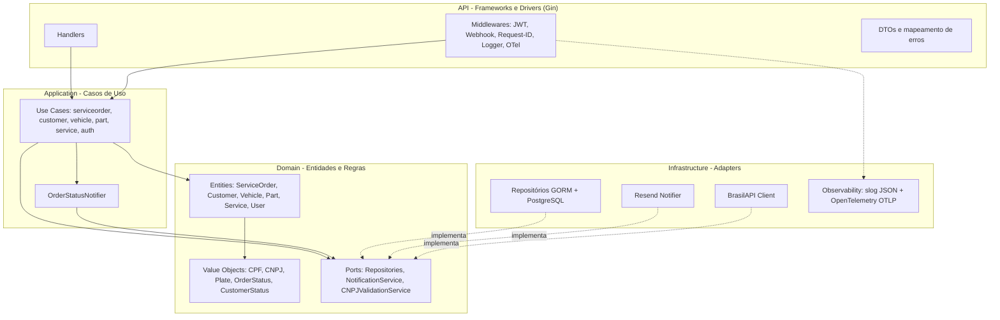
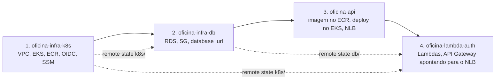

# Diagrama de Componentes

| | |
|---|---|
| **Status** | Vigente |
| **Data** | 2026-09-13 |
| **Autor** | Gabriel Camargo |

## 1. Visão de nuvem — APIs, banco, serverless e monitoramento

O diagrama abaixo mostra todos os componentes que participam de uma requisição em produção, quem os provisiona e para onde a telemetria flui. Setas contínuas são tráfego de requisição; setas tracejadas são deploy, leitura de configuração ou telemetria.

```mermaid
flowchart TB
    subgraph Users["Usuários"]
        Customer["Cliente da oficina"]
        Operator["Operador da oficina"]
    end

    subgraph GitHub["GitHub"]
        RepoApp["oficina-api"]
        RepoK8s["oficina-infra-k8s"]
        RepoDb["oficina-infra-db"]
        RepoLambda["oficina-lambda-auth"]
        Actions["GitHub Actions - OIDC"]
    end

    subgraph AWS["AWS us-east-1"]
        APIGW["API Gateway HTTP API"]
        LambdaAuth["Lambda auth-cpf"]
        LambdaAuthz["Lambda authorizer"]
        ECR[("ECR")]
        SSM[("SSM Parameter Store")]
        S3State[("S3 - Terraform state")]
        CloudWatch["CloudWatch Logs"]

        subgraph VPC["VPC 10.0.0.0/16 - 2 AZs"]
            subgraph PublicSubnets["Subnets públicas"]
                NLB["Network Load Balancer"]
                NAT["NAT Gateway"]
            end
            subgraph PrivateSubnets["Subnets privadas"]
                subgraph EKS["EKS 1.34 - node group t3.small 2..4"]
                    subgraph NsProd["namespace oficina-api"]
                        PodProd["Pods oficina-api"]
                        HPAProd["HPA 2..6 por CPU"]
                    end
                    subgraph NsHomolog["namespace oficina-api-homolog"]
                        PodHomolog["Pod oficina-api"]
                    end
                    NRAgent["New Relic nri-bundle"]
                end
                RDS[("RDS PostgreSQL 16")]
            end
        end
    end

    subgraph NewRelic["New Relic"]
        NRAPM["APM e traces"]
        NRLogs["Logs"]
        NRInfra["Infra Kubernetes"]
        NRDash["Dashboards"]
        NRAlerts["Alertas"]
        NRSynth["Synthetics - uptime"]
    end

    Resend["Resend - e-mail"]
    BrasilAPI["BrasilAPI - CNPJ"]

    Customer -->|"POST /auth/cpf"| APIGW
    Operator -->|"POST /api/v1/auth/login"| APIGW
    Customer -->|"GET /api/v1/service-orders/id/status"| APIGW
    Operator -->|"/api/v1/** com Bearer JWT"| APIGW

    APIGW --> LambdaAuth
    APIGW -.->|"valida JWT"| LambdaAuthz
    APIGW -->|"HTTP proxy"| NLB
    NLB --> PodProd
    LambdaAuth --> RDS
    PodProd --> RDS
    PodHomolog --> RDS
    PodProd --> Resend
    PodProd --> BrasilAPI
    HPAProd -.->|"escala"| PodProd

    LambdaAuth -.->|"jwt_secret, database_url"| SSM
    LambdaAuthz -.->|"jwt_secret"| SSM
    LambdaAuth -.-> CloudWatch
    LambdaAuthz -.-> CloudWatch

    RepoApp --> Actions
    RepoK8s --> Actions
    RepoDb --> Actions
    RepoLambda --> Actions
    Actions -.->|"build e push"| ECR
    Actions -.->|"kubectl apply -k"| EKS
    Actions -.->|"terraform apply"| S3State
    Actions -.->|"lê parâmetros"| SSM
    EKS -.->|"pull"| ECR

    PodProd -.->|"OTLP traces"| NRAPM
    PodProd -.->|"stdout JSON"| NRAgent
    NRAgent -.->|"logs"| NRLogs
    NRAgent -.->|"CPU e memória"| NRInfra
    NRSynth -.->|"ping /health"| APIGW
    NRLogs --> NRDash
    NRAPM --> NRDash
    NRInfra --> NRDash
    NRLogs --> NRAlerts
```

### Componentes e responsáveis

| Componente | Função | Repositório que provisiona |
|---|---|---|
| **API Gateway (HTTP API)** | Porta de entrada única. Roteia rotas públicas direto para o cluster e protege `ANY /api/v1/{proxy+}` com o Lambda authorizer. Integração `HTTP_PROXY` para o NLB. | `oficina-lambda-auth` |
| **Lambda `auth-cpf`** | Valida o CPF, consulta `customers` no RDS, exige `status = active` e emite JWT HS256 com validade de 1 h. Roda dentro da VPC (subnets privadas) com o SG `db-client`. | `oficina-lambda-auth` |
| **Lambda `authorizer`** | Authorizer do tipo REQUEST com resposta simples. Valida assinatura e expiração do JWT usando o segredo do SSM. Resultado cacheado por 5 min por token. | `oficina-lambda-auth` |
| **NLB** | Load balancer criado pelo `Service` do Kubernetes (tipo `LoadBalancer`). Descoberto pelo Terraform da Lambda por tag. | `oficina-api` (via manifesto) |
| **EKS + node group** | Cluster gerenciado 1.34 com 2 a 4 nós `t3.small` (AMI AL2023). Dois namespaces: `oficina-api` (produção) e `oficina-api-homolog`. | `oficina-infra-k8s` |
| **Pods `oficina-api` + HPA** | Aplicação Go em Clean Architecture. HPA de 2 a 6 réplicas a 60% de CPU. Probes em `/health`. | `oficina-api` |
| **RDS PostgreSQL 16.15** | `db.t3.micro`, privado, gp3 20 GB criptografado, backup 1 dia, Performance Insights e export de logs. Aceita 5432 apenas do SG dos nós e do SG `db-client`. | `oficina-infra-db` |
| **ECR** | Registry privado da imagem; scan de vulnerabilidades no push. | `oficina-infra-k8s` |
| **SSM Parameter Store** | Segredos como `SecureString`: `/oficina-api/jwt_secret`, `/oficina-api/webhook_secret` (k8s) e `/oficina-api/database_url` (db). Lidos pelo CD do app e pelo Terraform da Lambda. | `oficina-infra-k8s`, `oficina-infra-db` |
| **S3 (Terraform state)** | Bucket `oficina-api-terraform-state-728750563430` com lock nativo; chaves `k8s/`, `db/`, `lambda/`. | criado uma vez, fora do Terraform |
| **OIDC + roles IAM** | Um role por repositório, assumido pelo GitHub Actions sem chave estática. | `oficina-infra-k8s` |
| **CloudWatch Logs** | Logs das Lambdas e do RDS. | `oficina-lambda-auth`, `oficina-infra-db` |
| **New Relic `nri-bundle`** | Agente de infraestrutura, kube-state-metrics e Fluent Bit (logs) instalados via Helm. | `oficina-infra-k8s` (CD) |
| **New Relic APM / Logs / Infra** | Traces via OTLP direto da aplicação, logs JSON via Fluent Bit, CPU e memória dos pods. | — |
| **New Relic Dashboards / Alertas / Synthetics** | Dashboards NRQL (volume diário de OS, tempo médio por status, erros de integração, latência, recursos), alerta de `service_order.failed`, ping de uptime em `/health`. | — |
| **Resend** | Envio de e-mail ao cliente em cada mudança de status (best-effort). | — |
| **BrasilAPI** | Validação de CNPJ ativo no cadastro de cliente PJ. | — |

## 2. Camadas internas da aplicação — Clean Architecture

As dependências apontam sempre **para dentro**: a API depende dos casos de uso, que dependem do domínio. A infraestrutura implementa as **portas** definidas no domínio. Na Fase 3 a camada de infraestrutura ganhou o adapter de observabilidade (logger `slog` em JSON e provider OpenTelemetry), consumido pela camada de API via middlewares.

| Camada | Pasta | Depende de |
|---|---|---|
| Domain | `internal/domain` | nada externo |
| Application | `internal/application` | apenas do domínio |
| Infrastructure | `internal/infrastructure` | implementa portas do domínio; bibliotecas externas (GORM, Resend, OTel) |
| API | `internal/api` | casos de uso e adapters de observabilidade |

## 3. Fluxo de deploy entre repositórios

A ordem de criação da infraestrutura segue as dependências dos estados remotos. A destruição é feita na ordem inversa, removendo antes o `Service` do Kubernetes para que o NLB não bloqueie a VPC.

