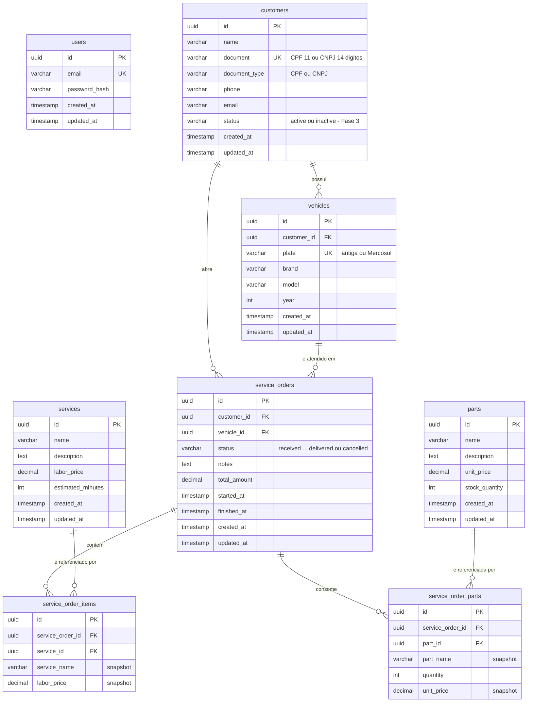

# Banco de Dados — Justificativa, Modelo Relacional e Ajustes

| | |
|---|---|
| **Status** | Vigente |
| **Data** | 2026-09-13 |
| **Autor** | Gabriel Camargo |
| **Relacionado** | [RFC-002](./rfc/RFC-002-escolha-do-banco-de-dados.md), [ADR-008](./adr/ADR-008-migrations-no-startup-da-aplicacao.md) |

## 1. Justificativa formal do PostgreSQL

O domínio da oficina é **transacional e fortemente relacional**: uma ordem de serviço referencia um cliente e um veículo, agrega itens de serviço e peças, e sua aprovação debita estoque. A escolha do PostgreSQL (gerenciado via Amazon RDS) se sustenta nos critérios abaixo.

| Critério | Por que pesa aqui | PostgreSQL | MySQL | DynamoDB | MongoDB |
|---|---|---|---|---|---|
| Transações ACID multi-tabela | Aprovar orçamento = mudar status da OS **e** debitar estoque de N peças, atomicamente | Nativo, MVCC | Nativo (InnoDB) | Limitado (25 itens, custo) | Suportado, mas modelo de documento desincentiva |
| Integridade referencial | OS não pode apontar para cliente/veículo inexistente; veículo pertence a um cliente | FK, `ON DELETE CASCADE` | FK | Não há | Não há |
| Tipos para dinheiro e identificadores | Preços com 2 casas exatas; ids UUID gerados na entidade | `NUMERIC(10,2)`, `UUID` nativo | `DECIMAL`, UUID como `CHAR(36)`/`BINARY(16)` | Number (ponto flutuante) | Decimal128 |
| Consultas analíticas do domínio | Tempo médio de execução por serviço, listagem ordenada por prioridade de status | SQL completo, `AVG`, `EXTRACT(EPOCH ...)`, window functions | SQL completo | Precisa de agregação na aplicação | Aggregation pipeline |
| Ecossistema Go | Migrations versionadas e driver maduro | `golang-migrate`, `pgx`, GORM | idem | SDK AWS | driver oficial |
| Operação gerenciada | Backup, criptografia, patches, Performance Insights sem esforço | RDS | RDS | Serverless | Atlas (fora da AWS) |
| Custo no free/low tier | Ambiente sobe e desce por sessão | `db.t3.micro` gp3 20 GB ≈ US$ 0,02/h | idem | pay-per-request barato, mas modelo não adere | Atlas M0 gratuito, mas fora da VPC |

**Conclusão:** PostgreSQL entrega integridade e transações sem esforço extra na aplicação, tem tipos exatos para dinheiro e UUID, e roda gerenciado dentro da mesma VPC do cluster. Alternativas NoSQL exigiriam reimplementar consistência na camada de aplicação, justamente o que o domínio não tolera.

## 2. Diagrama ER



## 3. Relacionamentos e regras

| Relacionamento | Cardinalidade | Regra de negócio / comportamento no banco |
|---|---|---|
| `customers` → `vehicles` | 1 : N | Um cliente tem vários veículos. `ON DELETE CASCADE`: remover o cliente remove seus veículos. Placa é única no sistema. |
| `customers` → `service_orders` | 1 : N | Toda OS pertence a um cliente identificado por CPF/CNPJ. Sem cascade: OS é histórico e não deve sumir com o cliente. |
| `vehicles` → `service_orders` | 1 : N | A OS é sempre sobre um veículo. O caso de uso valida que `vehicle.customer_id == order.customer_id` antes de gravar. |
| `service_orders` → `service_order_items` | 1 : N | Serviços (mão de obra) incluídos na OS. `ON DELETE CASCADE`: itens não existem sem a OS. |
| `service_orders` → `service_order_parts` | 1 : N | Peças consumidas na OS com quantidade. `ON DELETE CASCADE`. |
| `services` → `service_order_items` | 1 : N | Referência ao catálogo, sem cascade. |
| `parts` → `service_order_parts` | 1 : N | Referência ao estoque, sem cascade. |
| `users` | — | Operadores da oficina. Não se relaciona com clientes: são personas distintas (ver RFC-003). |

### Por que os itens guardam snapshot de nome e preço

`service_order_items.service_name/labor_price` e `service_order_parts.part_name/unit_price` **copiam** os valores do catálogo no momento da inclusão. Assim, reajustar o preço de uma peça amanhã não altera o orçamento já enviado ao cliente hoje. O `total_amount` da OS é calculado pela entidade a partir desses snapshots quando o orçamento é enviado (`SendBudget`), e fica congelado a partir dali.

### Máquina de estados da OS (coluna `status`)

```
received → in_diagnosis → waiting_approval → in_execution → finished → delivered
                                          ↘ cancelled
```

- `started_at` é preenchido na transição para `in_execution`; `finished_at` na transição para `finished`.
- O endpoint de métricas calcula o tempo médio de execução por serviço com `AVG(finished_at - started_at)` sobre OS finalizadas ou entregues.
- A transição é validada **na entidade** (`OrderStatus.CanTransitionTo`), não por trigger ou constraint, mantendo a regra no domínio.

## 4. Ajustes do modelo relacional na Fase 3 — migration `000010`

Nenhuma migration anterior foi alterada; tudo entra em uma nova versão aplicada automaticamente no startup.

### 4.1 Status do cliente

```sql
ALTER TABLE customers ADD COLUMN status VARCHAR(20) NOT NULL DEFAULT 'active';
```

- Valores: `active` e `inactive`, controlados pelo value object `CustomerStatus` na entidade.
- **Motivação:** o requisito da Lambda de autenticação é *"consultar a existência e o status do cliente na base"*. Um cliente inativo continua existindo (histórico de OS preservado) mas não recebe token.
- A aplicação expõe `PATCH /api/v1/customers/{id}/status` para o operador ativar/inativar, e devolve `status` nas respostas de cliente.

### 4.2 Normalização de `document_type`

```sql
UPDATE customers SET document_type = UPPER(document_type);
```

O seed da Fase 1 gravou `cpf`/`cnpj` em minúsculo enquanto a entidade grava `CPF`/`CNPJ`. A normalização garante que qualquer filtro por tipo de documento (inclusive na Lambda) seja determinístico.

### 4.3 Índices

| Índice | Consulta que atende | Onde a aplicação a executa |
|---|---|---|
| `service_orders(status)` | Listagem de OS ativas (`WHERE status IN (...)`), exclusão de finalizadas/entregues, métricas | `FindByStatuses`, `GetExecutionMetrics` |
| `service_orders(customer_id)` | Histórico de OS por cliente, junção cliente ↔ OS na notificação | `OrderStatusNotifier`, relatórios |
| `service_orders(vehicle_id)` | OS por veículo, verificação de posse | `CreateServiceOrder` |
| `vehicles(customer_id)` | Veículos de um cliente, cascade de exclusão | `CreateVehicle`, `DeleteCustomer` |
| `service_order_items(service_order_id)` | Carregar itens ao detalhar uma OS | `FindByID` (preload) |
| `service_order_parts(service_order_id)` | Carregar peças ao detalhar/aprovar OS | `FindByID`, `ApproveBudget` |
| `customers(status)` | Filtrar clientes ativos; consulta da Lambda combina `document` (já único) e `status` | Lambda `auth-cpf`, listagens administrativas |

Chaves estrangeiras no PostgreSQL **não** criam índice automaticamente na coluna referenciadora; por isso os índices em `customer_id`, `vehicle_id` e `service_order_id` são explícitos. Todos são B-tree simples, de baixo custo de escrita para o volume esperado.

### 4.4 Parâmetros do RDS (repositório `oficina-infra-db`)

- `log_min_duration_statement = 500` — registra no CloudWatch qualquer consulta acima de 500 ms, insumo para detectar gargalos.
- Performance Insights habilitado — visão de espera por consulta sem instalar nada no banco.
- Backup automático de 1 dia e storage gp3 criptografado — suficiente para um ambiente que sobe e desce por sessão; em produção real o retention seria maior (ver RFC-002).

## 5. Consistência e desempenho

- **Transação na aprovação do orçamento.** `ApproveBudgetUseCase` muda o status, debita o estoque de cada peça e persiste a OS. O repositório executa a gravação da OS (cabeçalho + itens + peças) em uma única transação GORM; o débito de estoque é validado na entidade `Part` (`ErrPartInsufficientStock`) antes de qualquer `UPDATE`.
- **Sem soft delete.** Clientes, veículos, peças e serviços são removidos fisicamente; OS nunca são removidas por API (só saem da listagem ativa quando terminam). A coluna `deleted_at` prevista na convenção do projeto fica reservada para quando houver exigência de auditoria.
- **Timestamps.** Todas as tabelas de agregado têm `created_at` e `updated_at`; tabelas de item (`service_order_items`, `service_order_parts`) herdam o ciclo de vida da OS e por isso não os repetem.
- **Conexão.** A aplicação e a Lambda usam `sslmode=require` contra o RDS privado. O acesso é restrito por security group (nós do EKS e SG `db-client` da Lambda), sem IP público.
- **Unicidade.** `customers.document`, `vehicles.plate` e `users.email` são `UNIQUE`; a aplicação traduz a violação em `409 Conflict`.
