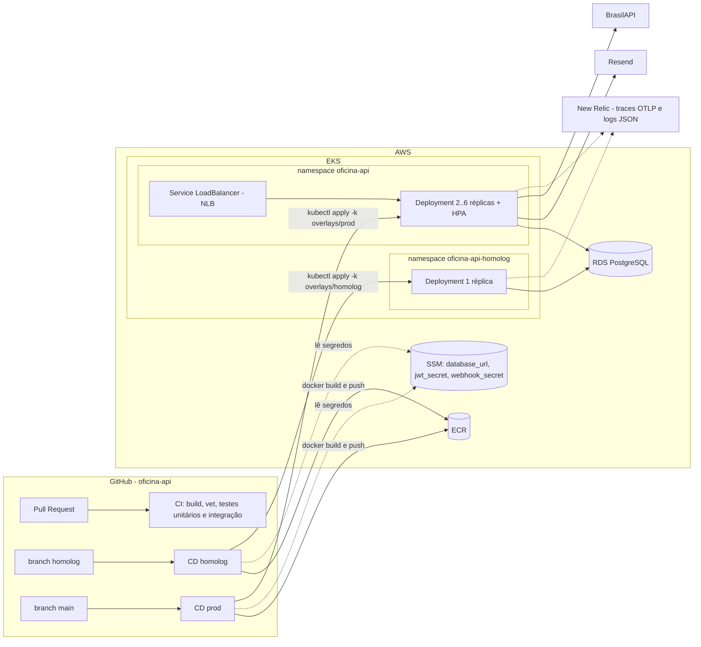
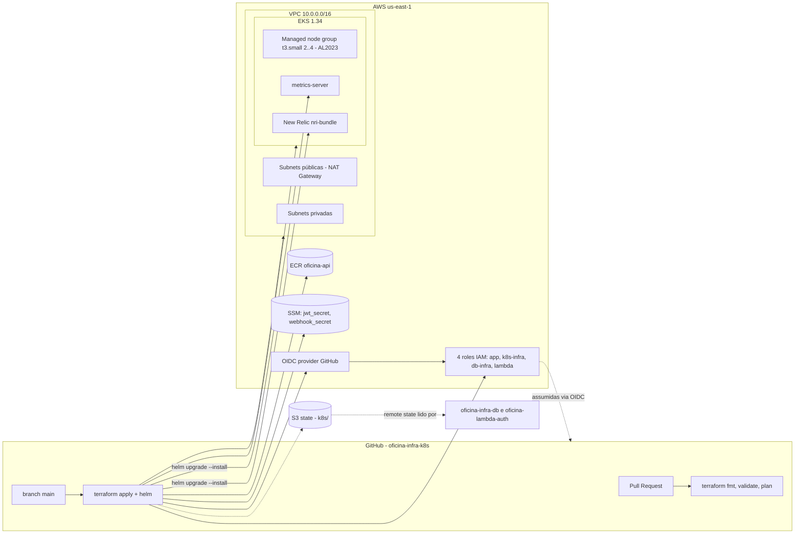
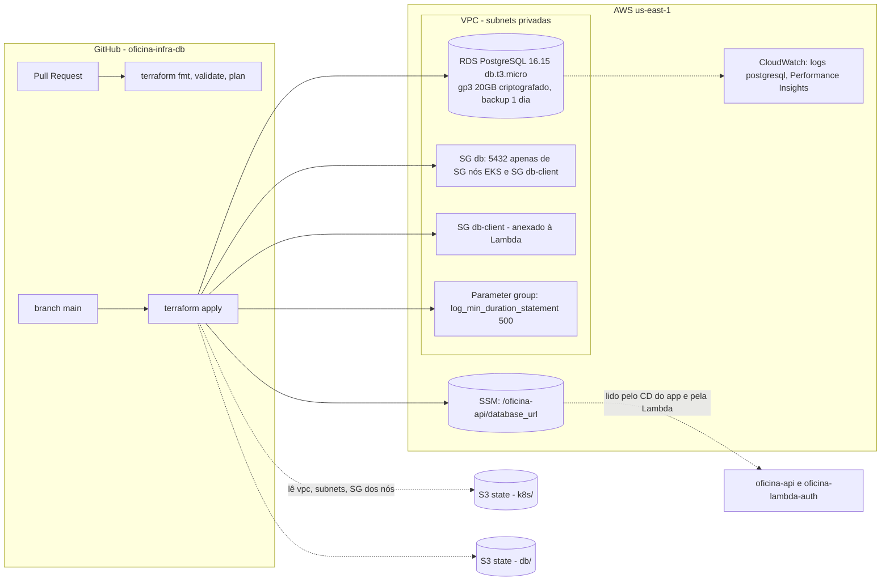
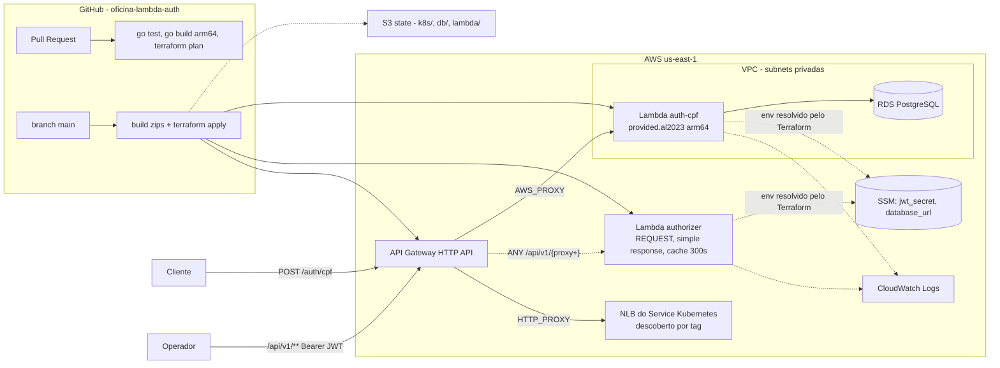

# Diagramas por repositório

| | |
|---|---|
| **Status** | Vigente |
| **Data** | 2026-09-13 |
| **Autor** | Gabriel Camargo |

Cada bloco abaixo é o diagrama de arquitetura específico de um repositório, pronto para ser colado na seção "Arquitetura" do respectivo `README.md`.

## 1. `oficina-api` — aplicação principal

## 2. `oficina-infra-k8s` — infraestrutura Kubernetes

## 3. `oficina-infra-db` — banco de dados gerenciado

## 4. `oficina-lambda-auth` — function serverless e API Gateway

