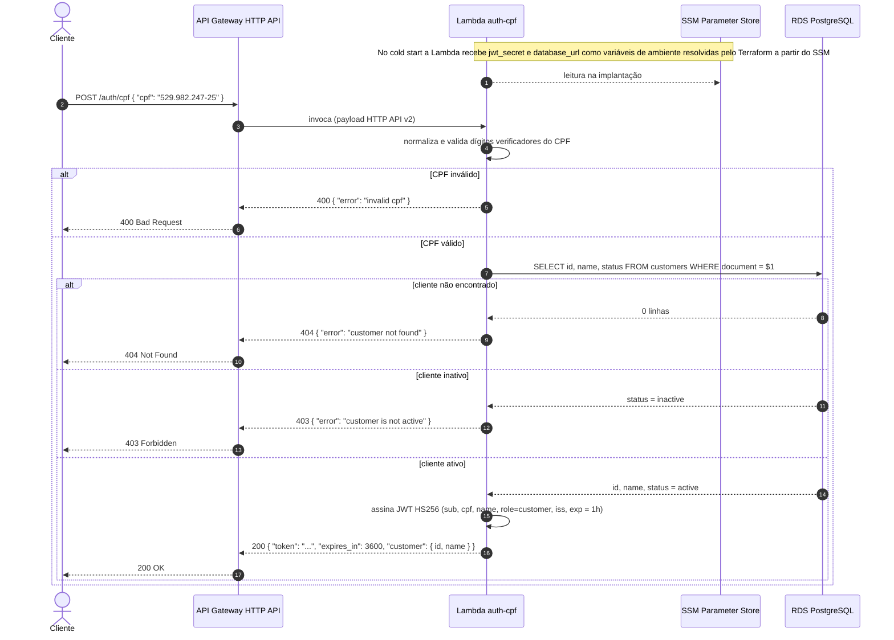
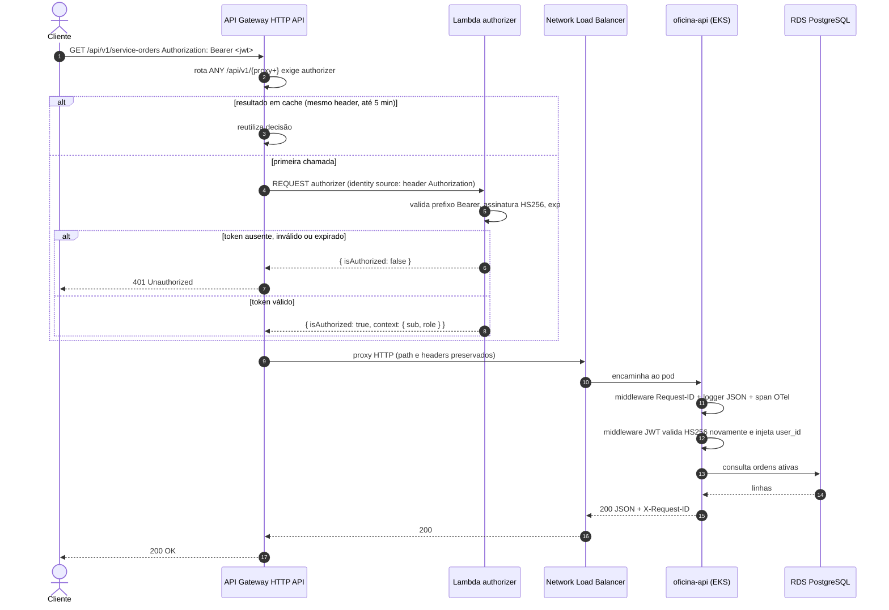
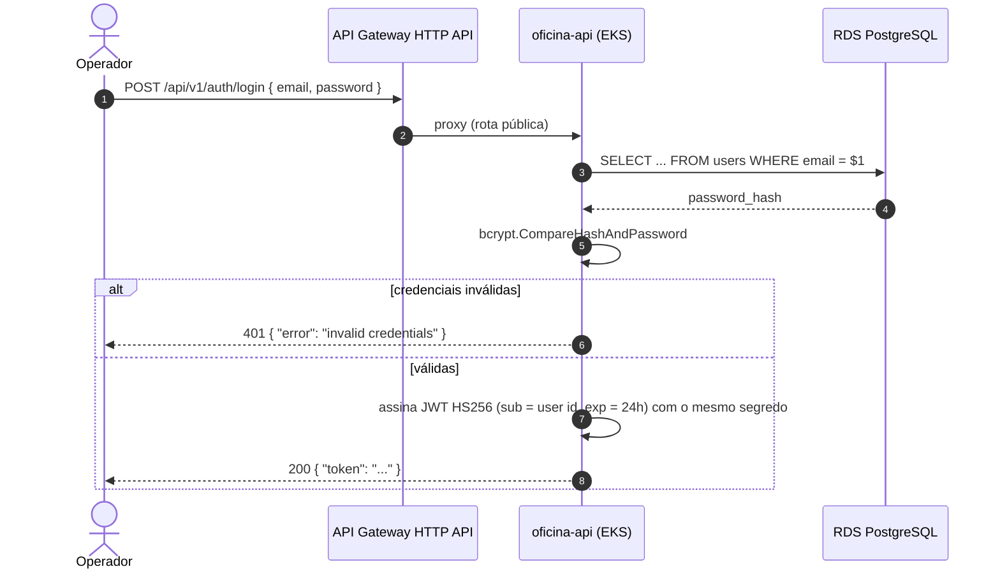

# Diagrama de Sequência — Autenticação

| | |
|---|---|
| **Status** | Vigente |
| **Data** | 2026-09-13 |
| **Autor** | Gabriel Camargo |

Existem **dois emissores** do mesmo tipo de token (JWT HS256, segredo único em `/oficina-api/jwt_secret`):

| Ator | Rota | Emissor | Credencial | Claims principais |
|---|---|---|---|---|
| Cliente da oficina | `POST /auth/cpf` | Lambda `auth-cpf` | CPF (cliente ativo na base) | `sub` = id do cliente, `cpf`, `name`, `role = customer`, `iss`, `exp` (1 h) |
| Operador | `POST /api/v1/auth/login` | Aplicação (`LoginUseCase`) | e-mail + senha (bcrypt, tabela `users`) | `sub` = id do usuário, `exp` (24 h) |

Ambos os tokens são aceitos pelo **Lambda authorizer** no API Gateway e pelo **middleware JWT** da aplicação. A validação dupla é intencional (defesa em profundidade, ver [ADR-007](./adr/ADR-007-lambda-authorizer-na-borda.md)).

## 1. Autenticação de cliente por CPF

## 2. Consumo de rota protegida com o token

### Rotas que não passam pelo authorizer

| Rota | Motivo |
|---|---|
| `GET /health` | Probe de saúde e uptime (Synthetics) |
| `GET /swagger/{proxy+}` | Documentação pública |
| `POST /api/v1/auth/login`, `POST /api/v1/auth/register` | Emissão de token de operador |
| `POST /auth/cpf` | Emissão de token de cliente (Lambda) |
| `GET /api/v1/service-orders/{id}/status` | Consulta pública de status pelo cliente |
| `POST /api/v1/service-orders/{id}/budget-approval` | Webhook externo autenticado pelo header `X-Webhook-Secret`, validado pela aplicação |

No HTTP API a rota mais específica vence; por isso essas rotas explícitas ficam fora da proteção de `ANY /api/v1/{proxy+}`.

## 3. Login de operador (fluxo existente desde a Fase 1)

