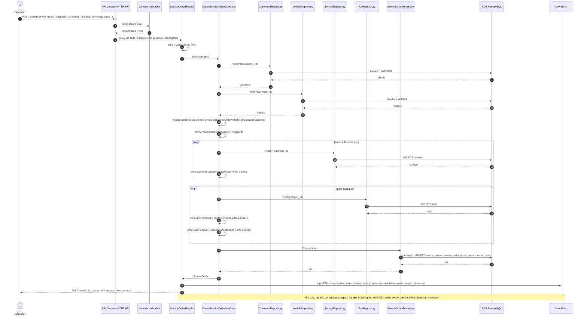
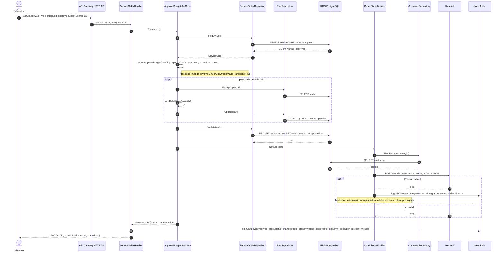

# Diagrama de Sequência — Ordem de Serviço

| | |
|---|---|
| **Status** | Vigente |
| **Data** | 2026-09-13 |
| **Autor** | Gabriel Camargo |

## 1. Abertura de OS em chamada única

Desde a Fase 2 a OS é aberta com cliente, veículo, serviços e peças no mesmo `POST`. Na Fase 3 a requisição passa pelo API Gateway e pelo authorizer, e a aplicação passa a emitir o evento `service_order.created` nos logs estruturados, que alimenta o dashboard de volume diário no New Relic.

### Tratamento de erros nesta rota

| Erro de domínio | HTTP | Evento emitido |
|---|---|---|
| `ErrCustomerNotFound`, `ErrVehicleNotFound`, `ErrServiceNotFound`, `ErrPartNotFound` | 404 | `service_order.failed` |
| `ErrServiceOrderVehicleNotOwnedByCustomer`, `ErrPartInsufficientStock`, `ErrServiceOrderItemInvalidQty` | 422 | `service_order.failed` |
| erro de infraestrutura (banco) | 500 sem vazar detalhe | `service_order.failed` |

## 2. Transição de status com notificação e telemetria

Todas as transições (`start-diagnosis`, `send-budget`, `approve-budget`, `reject-budget`, `finish-execution`, `deliver` e o webhook `budget-approval`) seguem o mesmo padrão: a entidade valida a máquina de estados, o repositório persiste, o notificador envia e-mail em modo best-effort e o evento `service_order.status_changed` registra quanto tempo a OS ficou no status anterior.

### Como o New Relic usa esses eventos

| Requisito do PDF | Evento / fonte | Consulta NRQL (exemplo) |
|---|---|---|
| Volume diário de ordens de serviço | `service_order.created` | `SELECT count(*) FROM Log WHERE event = 'service_order.created' TIMESERIES 1 day` |
| Tempo médio por status (diagnóstico, execução, finalização) | `service_order.status_changed` com `from_status` e `duration_minutes` | `SELECT average(duration_minutes) FROM Log WHERE event = 'service_order.status_changed' FACET from_status` |
| Erros e falhas nas integrações | `integration.error` | `SELECT count(*) FROM Log WHERE event = 'integration.error' FACET integration` |
| Alertas para falhas no processamento de OS | `service_order.failed` | condição NRQL `SELECT count(*) FROM Log WHERE event = 'service_order.failed'` acima de 0 em 5 min |
| Latência das APIs | spans `otelgin` e campo `latency_ms` do log de requisição | `SELECT percentile(duration.ms, 50, 95) FROM Span WHERE service.name = 'oficina-api' FACET http.route` |

Todos os logs carregam `request_id`, `trace_id` e `span_id`, então a partir de um evento de negócio é possível abrir o trace da requisição e vice-versa (ver [ADR-006](./adr/ADR-006-logs-estruturados-com-correlacao.md)).
